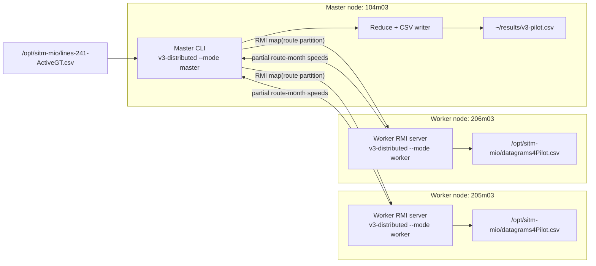

# Version 3 Deployment

The distributed version uses Java RMI and the Master-Worker pattern. The deployment assumes that
each processing server can read the assignment CSV files from its local filesystem path.



## Runtime Responsibilities

- Master:
  - reads active routes;
  - partitions routes evenly by worker count;
  - connects to workers with RMI;
  - dispatches one partition per worker;
  - merges partial results;
  - writes the final CSV.

- Worker:
  - exposes `IWorker.map()` over RMI;
  - receives assigned routes and CSV configuration;
  - reads the datagram file locally;
  - filters to assigned routes;
  - calculates segments and aggregates by route-month;
  - returns partial aggregates to the master.

## Deployment Command

Use:

```bash
bash scripts/deploy-v3.sh
```

The script builds the v3 distribution, copies it to the master and worker hosts, starts workers,
runs the master, and stops the workers.

